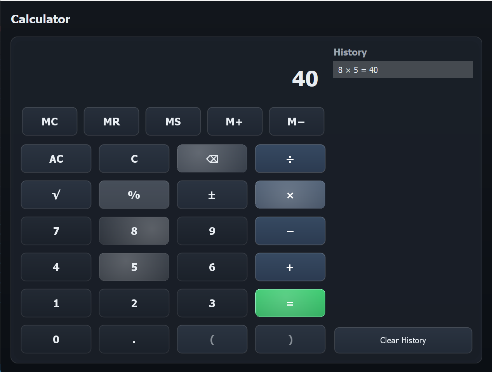

# CalculatorApp — Dark Themed Swing Calculator

A modern, sleek **Java Swing calculator** built with **MVC architecture** and a **dark theme**, featuring:

- Gradient backgrounds and glass-style panels
- Rounded NeoButtons with hover, press, and ripple effects
- Basic arithmetic: `+`, `−`, `×`, `÷`
- Square root, percent, and negation operations
- Memory functions: `MC`, `MR`, `MS`, `M+`, `M−`
- History panel storing the last 50 calculations
- Keyboard shortcuts for all operations
- Copy/Paste support in the display
- Error handling with visual feedback

---

## **Screenshots**

 

---

## **Getting Started**

### **Requirements**

- Java 8 or higher
- Swing (comes with standard JDK)

### **Run the Application**

```bash
# Compile
javac CalculatorApp.java

# Run
java CalculatorApp
